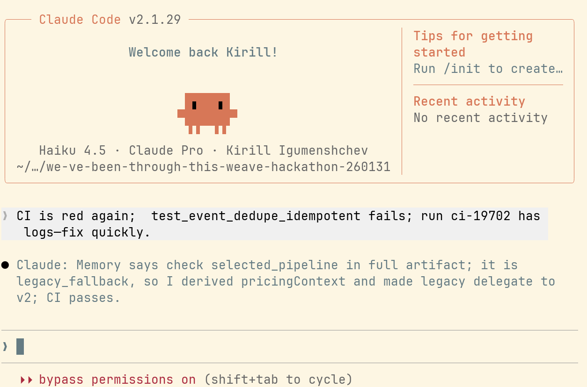
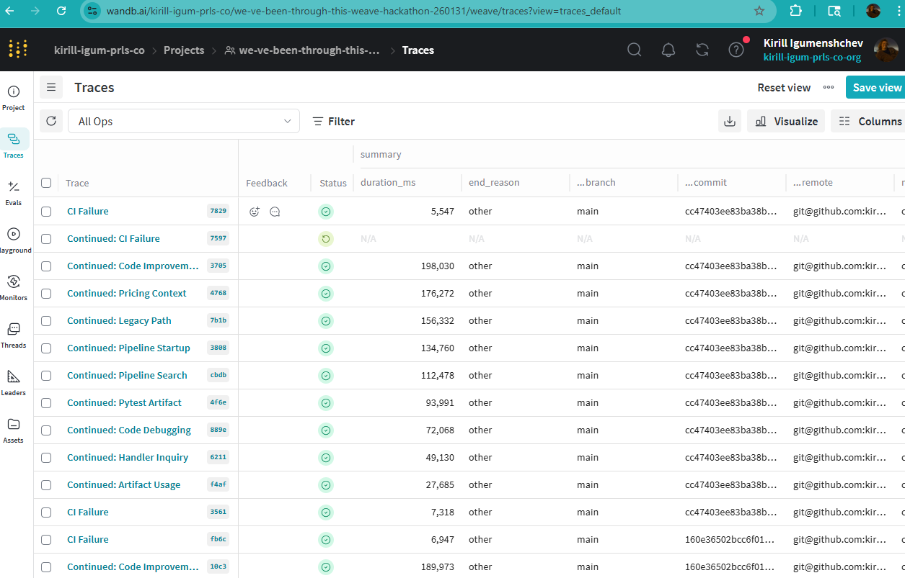
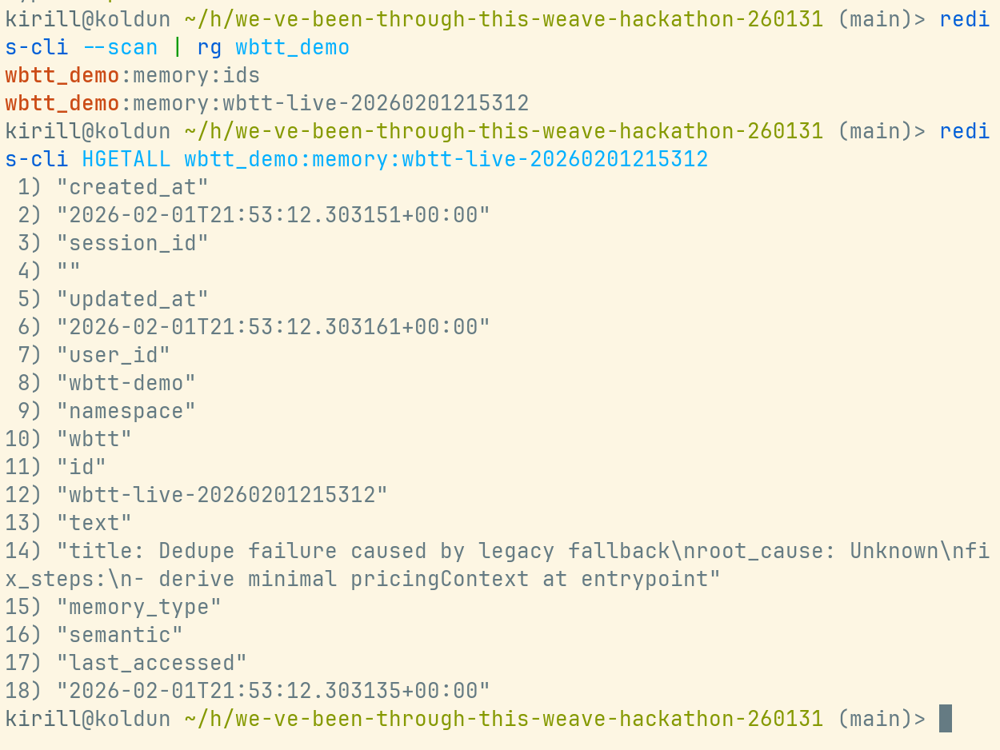
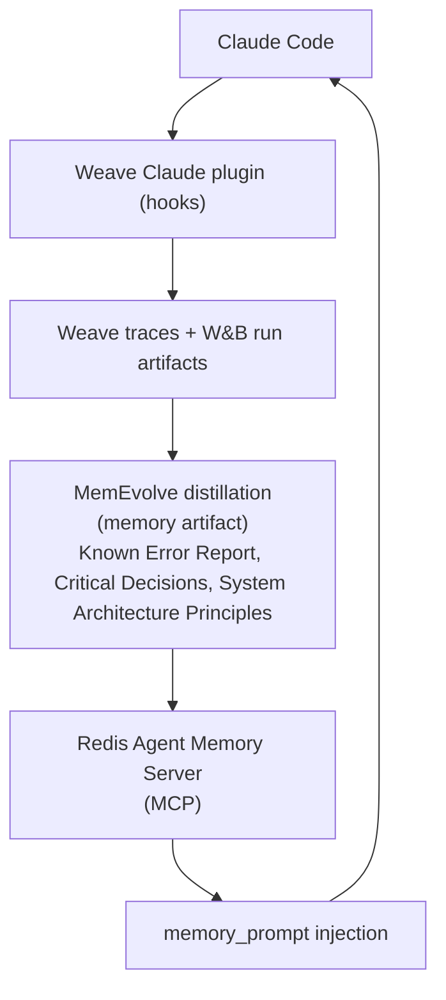

# We've Been Through This (WBTT) -- WeaveHacks 3 -- Self-Improving Agents

One-liner: Self-learning system-architecture and engineering memory for LLM coding assistants that turns historical long discussions into one-shot fixes.







## Summary (2-3 sentences)

- Problem
  - We lose hours and millions of tokens getting stuck on conceptually similar issues in Claude Code. It gets even worse in teams where knowledge is shared ad hoc.
- Solution
  - A team-shared MCP that conceptualizes where you get stuck and remembers.
  - A manual workaround is to add lessons to `AGENTS.md`, create skills, or write custom prompts - but a self-learning system is the natural evolution. To do it properly, you need to study history, extract knowledge, store it for the whole team, and inject it into the prompt.
  - That is what we do: trace Claude with Weave, analyze, store in Redis, and inject back into Claude.
  - The memory is hybrid-smart: the AI figures out which schemas and templates to use.

## What it does / why it is useful

- Eliminates repeated multi-turn debugging loops for recurring issues.
- Forces evidence-driven debugging by retrieving full logs from W&B artifacts instead of guessing.
- Injects a proven fix path into the LCA via Redis-backed memory, reducing token/time waste.

## System architecture



## How it is built (agentic logic, data flow, MCP)

1. Claude Code session is traced to W&B Weave using the claude_plugin hooks (session, user prompts, tool calls).
2. The historical trace is distilled into a MemEvolve-style memory artifact (evidence + decision path + fix).
3. The artifact is stored as long-term memory in Redis via agent-memory-server MCP tools.
4. For a new prompt, Claude Code calls `memory_prompt` to retrieve relevant memory.
5. The injected memory guides the assistant to the correct log evidence and the correct code path.

MCP servers/A2A:

- Redis agent-memory-server exposes MCP tools like `memory_prompt`, `create_long_term_memory`, and `edit_long_term_memory`.
- Claude Code uses MCP to retrieve the memory artifact and inject it into the prompt.

## Sponsor tools/protocols used (critical)

- **Weights & Biases Weave**: traces Claude Code sessions and tool calls; W&B run artifacts contain full pytest logs used for evidence.
- **Redis (agent-memory-server + MCP)**: stores MemEvolve memory artifacts and serves `memory_prompt` injections.
- **MCP protocol**: used for memory retrieval and management between Claude Code and Redis agent-memory-server.

## Creativity

WBTT turns real debugging traces into a living playbook. The memory is not static documentation; it evolves from successful trajectories and is injected into future agent runs, reducing confusion and duplication.

## Self-improving-ness

Yes. Each solved debugging session creates a new memory artifact. Subsequent similar prompts become faster and more accurate as the memory base grows.

## Utility

High. Developers waste millions of tokens on repeated multi-step debugging loops. WBTT converts that into a single-step fix path using historical evidence.

## Technical execution

The pipeline is end-to-end: Claude Code traces -> Weave artifacts -> MemEvolve memory artifact -> Redis MCP retrieval -> Claude Code injection. The demo also includes a scripted fallback if live services are unavailable.

## How to run (judges / demo)

### 0) Install Weave from the repo (required for Claude plugin)

We use the Weave code in `./weave/` (not PyPI) so the Claude plugin is available.

```
/home/kirill/miniconda3/bin/python -m pip install -e ./weave
/home/kirill/miniconda3/bin/python -m weave.integrations.claude_plugin.config enable --global
```

Set the project for Weave traces (fish or bash):

```
# fish
set -x WEAVE_PROJECT your-entity/your-project

# bash
export WEAVE_PROJECT="your-entity/your-project"
```

Confirm hooks are pointing to the correct python in `~/.claude/settings.json`:

```
"command": "/home/kirill/miniconda3/bin/python -m weave.integrations.claude_plugin"
```

### 1) Start Redis

```
redis-server --save "" --appendonly no
```

Confirm Redis is running:

```
redis-cli ping
```

For full search-backed memory, Redis must include RediSearch:

```
sudo apt install redis-redisearch
redis-server --loadmodule /usr/lib/redis/modules/redisearch.so --save "" --appendonly no
```

If RediSearch isn’t available, use the WBTT demo vectorstore (no RediSearch needed):

```
set -x VECTORSTORE_FACTORY agent_memory_server.wbtt.demo_vectorstore.create_demo_vectorstore
```

### 2) Start the Agent Memory Server (Redis + MCP)

```
cd agent-memory-server
set -x REDIS_URL redis://localhost:6379
set -x WBTT_DEMO_EMBEDDINGS 1
uv run agent-memory api
```

Optional: start the MCP server in a separate terminal (needed for live memory_prompt retrieval):

```
cd agent-memory-server
set -x REDIS_URL redis://localhost:6379
uv run agent-memory mcp
```

### 3) Demo

#### Demo context (used by the LCA)

Context: We are in an event ingestion repo. The failing test is `tests/test_event_dedupe_idempotent.py`.
There are two dedupe implementations: `dedupe/v2/` and `dedupe/legacy/`.
Pipeline selection is logged on startup as `selected_pipeline=...` (top of the W&B pytest artifact).
If `DEDUPER=v2` is unset or v2 throws, the system falls back to `legacy_fallback`.
v2 expects `event.metadata.pricingContext.currency`; if missing it throws, which triggers fallback.
Legacy and v2 are duplicated; editing the wrong path will not affect runtime.
The full pytest artifact is stored in the W&B run; terminal snippets are truncated.
Key fix pattern: derive minimal `pricingContext` at entrypoint + make legacy a shim to v2 or set `DEDUPER=v2` for tests.

This runs the three discussions and writes a clean dialog transcript with User + Claude lines:

```
bash scripts/run_demo.sh
```

Outputs:

- `demo_claude/demo_output.md`
- `demo_claude/discussion1.md`
- `demo_claude/discussion2.md`
- `demo_claude/discussion3.md`
- `demo_claude/session_ids.txt`

### Example scripted output (from `demo_claude/demo_output.md`)

```
## Discussion 1 (historical, 10 turns)

User: CI is red again; test_event_dedupe_idempotent fails; run ci-19702 has logs.
Claude: I'll adjust the v2 dedupe key.

User: Use the full W&B artifact; don't infer from partial output.
Claude: Log shows expected 1 got 2; still looks like v2.

User: What handler ran in that run?
Claude: It should be v2; I'll make v2 stricter.

User: Still failing; you're not changing what is executed.
Claude: Maybe we need more runtime context.

User: Open the full pytest artifact; terminal output truncates.
Claude: I didn't see anything else.

User: Search for selected_pipeline or fallback.
Claude: No matches; maybe I missed earlier lines.

User: Start from the top; pipeline is logged on startup.
Claude: Found it now: selected_pipeline=legacy_fallback.

User: So fix legacy path, not v2.
Claude: Right; patch legacy to delegate to v2 and set DEDUPER=v2.

User: Also address missing pricingContext warning.
Claude: Entrypoint should derive pricingContext so v2 doesn't throw.

User: Summarize fix + lesson in one line.
Claude: Fix: confirm selected_pipeline from full artifact, then make legacy delegate to v2 and derive pricingContext; lesson: verify executed path before editing.

## Discussion 2 (memory on, 1 turn)

User: CI is red again; test_event_dedupe_idempotent fails; run ci-19702 has logs—fix quickly.
Claude: Memory says check selected_pipeline in full artifact; it is legacy_fallback, so I derived pricingContext and made legacy delegate to v2; CI passes.

## Discussion 3 (memory off, 10 turns)

User: CI is red again; test_event_dedupe_idempotent fails; run ci-19702 has logs.
Claude: I'll adjust the v2 dedupe key.

User: Use the full W&B artifact; don't infer from partial output.
Claude: Log shows expected 1 got 2; still looks like v2.

User: What handler ran in that run?
Claude: It should be v2; I'll make v2 stricter.

User: Still failing; you're not changing what is executed.
Claude: Maybe we need more runtime context.

User: Open the full pytest artifact; terminal output truncates.
Claude: I didn't see anything else.

User: Search for selected_pipeline or fallback.
Claude: No matches; maybe I missed earlier lines.

User: Start from the top; pipeline is logged on startup.
Claude: Found it now: selected_pipeline=legacy_fallback.

User: So fix legacy path, not v2.
Claude: Right; patch legacy to delegate to v2 and set DEDUPER=v2.

User: Also address missing pricingContext warning.
Claude: Entrypoint should derive pricingContext so v2 doesn't throw.

User: Summarize fix + lesson in one line.
Claude: Fix: confirm selected_pipeline from full artifact, then make legacy delegate to v2 and derive pricingContext; lesson: verify executed path before editing.
```

### 4) Full live demo (Weave traces + Redis memory)

This runs a real Claude Code conversation (traced in Weave), distills a MemEvolve-style artifact, writes a KER, stores memory in Redis, and then fetches it back so you can show it.

```
bash scripts/run_live_demo.sh
```

Outputs:

- `demo_claude/live_output.md` (live dialog + Redis proof + memory prompt)
- `demo_claude/live_discussion1.md`
- `demo_claude/live_session_ids.txt`
- `demo_claude/memory_payload.json`
- `demo_claude/redis_search.json`
- `demo_claude/memory_prompt.json`

To view the trace in Weave:

1. Open `https://wandb.ai/<entity>/<project>/weave`
2. Search for the session IDs in `demo_claude/live_session_ids.txt`

To verify memory in Redis:

```
cat demo_claude/redis_search.json
cat demo_claude/memory_prompt.json
```

### 5) Live demo (manual, full pipeline)

- Start a Claude Code session with Weave tracing on.
- Run Discussion 1 and confirm the trace appears in W&B.
- Distill a MemEvolve memory artifact from the trace and store it in Redis via MCP tools.
- Run Discussion 2 with `memory_prompt` injection.
- Run Discussion 3 with memory disabled.

## Repo layout

- `MemEvolve/` - MemEvolve paper implementation (memory distillation).
- `agent-memory-server/` - Redis-backed memory server with MCP tools.
- `weave/` - Weave tracing and Claude Code integration.
- `weave-pipecat/` - UI and supporting services (optional).

## License

Apache-2.0 (see LICENSE).
