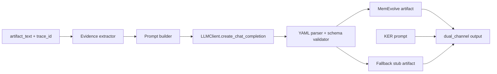

Title and Metadata
- project_name: WBTT MemEvolve LLM Distillation
- version: 0.1.0
- owners: kirill (product/engineering), agent-memory-server maintainers
- date: 2026-02-01
- document_id: WBTT-PLAN-LLM-DISTILL-001
- summary: Implement an LLM-backed MemEvolve distillation path for WBTT using the existing agent-memory-server LLM infrastructure, with schema-validated YAML output, repair/fallback safety, and deterministic test coverage; scope is limited to distillation, dual-channel integration, and demo/script updates inside this repository.

Design Consensus & Trade-offs
- Topic: LLM-backed distillation vs. static stub
  - Verdict: FOR LLM-backed with deterministic fallback
  - Rationale: Current distiller in agent-memory-server/agent_memory_server/wbtt/dual_channel.py is stubbed; calling a MemEvolve prompt is required for real memory artifacts while keeping demo reliability when keys or models are unavailable.
- Topic: LLM client implementation
  - Verdict: FOR agent_memory_server.llm.LLMClient (LiteLLM)
  - Rationale: Uses existing settings, env loading via agent_memory_server/config.py, and supports multiple providers without new dependencies.
- Topic: Output format
  - Verdict: FOR YAML-only responses
  - Rationale: MemEvolve prompt in agent-memory-server/tests/fixtures/wbtt/prompts/memory_distillation_prompt.txt is YAML-like and is easier to validate against required schema.
- Topic: Validation and repair
  - Verdict: FOR strict schema validation with single repair attempt and fallback to stub
  - Rationale: Prevents brittle failures from malformed YAML while constraining latency and complexity.
- Topic: Activation control
  - Verdict: FOR explicit env gating (WBTT_DISTILL_WITH_LLM)
  - Rationale: Avoids CI and demo failures when API keys or model access are missing, despite .env availability.

PRD (IEEE 29148 Stakeholder/System Needs)
- Problem
  - Teams lose hours and large token budgets repeatedly solving conceptually similar Claude Code failures; lessons are not reliably shared or injected at the time of need.
- Users
  - Claude Code users, hackathon demos, and teams using agent-memory-server for memory injection.
- Value
  - Converts historical traces into reusable memory artifacts and injects them in future prompts to reduce multi-step debugging loops.
- Business Goals
  - Demonstrate self-learning, team-shared memory with trace-backed evidence using Weave + Redis.
- Success Metrics
  - >= 95% schema-valid MemEvolve artifacts produced from fixtures in tests.
  - Distillation path produces a non-empty artifact and KER in dual-channel flow with LLM enabled.
  - Demo script completes without manual edits when keys are set.
- Scope
  - agent-memory-server WBTT distillation path and tests.
  - Prompt assembly, YAML parsing, validation, repair/fallback, and telemetry logs.
  - Demo script updates and minimal README note.
- Non-goals
  - Full MemEvolve training/evolution pipeline.
  - Weave UI changes or new front-end components.
  - New MCP APIs beyond existing memory tools.
- Dependencies
  - agent-memory-server LLM infrastructure (agent_memory_server/llm/client.py)
  - .env with OPENAI_API_KEY or other provider keys
  - MemEvolve prompt fixture in agent-memory-server/tests/fixtures/wbtt/prompts/memory_distillation_prompt.txt
- Risks
  - LLM output not valid YAML or missing required keys.
  - Prompt size too large for model context.
  - API rate limits or model access issues.
- Assumptions
  - .env is loaded by agent_memory_server/config.py.
  - The repository uses uv + pytest for tests (agent-memory-server/Makefile).

SRS (IEEE 29148 Canonical Requirements)
4.1 Functional Requirements
- REQ-001 (type: func): Distill a MemEvolve memory artifact by calling an LLM with a MemEvolve prompt plus trace evidence.
- REQ-002 (type: func): Use agent_memory_server.config settings (generation_model, api keys) and env gating (WBTT_DISTILL_WITH_LLM) to decide whether to call the LLM.
- REQ-003 (type: func): Parse YAML output into a dict, validate required schema, and attempt one repair pass if invalid; if still invalid, fall back to the stub artifact.
- REQ-004 (type: func): Preserve dual-channel behavior by returning both memevolve_artifact and ker_output from run_dual_channel.
- REQ-005 (type: func): Prompt assembly must include extracted evidence lines and a truncated artifact excerpt.
- REQ-006 (type: func): Record distillation telemetry (success/fallback/repair) via structured logs.

4.2 Non-functional Requirements
- REQ-101 (type: perf): Distillation path must complete within 30s for fixture-sized artifacts when LLM is enabled.
- REQ-102 (type: nfr): Distillation must always produce a schema-valid artifact (LLM or stub).
- REQ-103 (type: nfr): Prompt text must be redacted for obvious secrets before sending to LLM.
- REQ-104 (type: nfr): LLM temperature must be <= 0.2 to reduce variance.

4.3 Interfaces/APIs
- REQ-201 (type: int): Provide a callable distiller function (async) with signature (trace_id, artifact_text, distillation_prompt) -> dict.
- REQ-202 (type: int): Support env variables OPENAI_API_KEY (or other provider keys), GENERATION_MODEL, WBTT_DISTILL_WITH_LLM, and optional WBTT_DISTILL_MODEL override.
- REQ-203 (type: int): run_dual_channel continues to accept (trace_id, artifact_text, distillation_prompt, ker_prompt) and returns a dict with keys memevolve_artifact and ker_output.

4.4 Data Requirements
- REQ-301 (type: data): MemEvolve artifact schema must include required keys: title, trigger_cues, evidence_to_check, root_cause, fix_steps, anti_patterns, tags, confidence, source_trace_id, created_at.
- REQ-302 (type: data): evidence_to_check must be sourced from artifact_text evidence lines or “Unknown”.
- REQ-303 (type: data): created_at must be ISO date (YYYY-MM-DD).
- REQ-304 (type: data): source_trace_id must equal the trace_id input.

4.5 Error & Telemetry expectations
- REQ-401 (type: nfr): Log a structured event on LLM distillation success with model and token usage.
- REQ-402 (type: nfr): Log a structured event when repair is attempted or fallback is used, including validation error list.
- REQ-403 (type: nfr): Do not log full prompt or artifact text in error logs.

4.6 Acceptance Criteria
- LLM-enabled distillation produces a schema-valid artifact from the fixture prompt and sample artifact.
- Invalid YAML output triggers exactly one repair attempt then falls back to stub.
- Dual-channel output includes memevolve_artifact and ker_output with the given trace_id.
- Prompt includes evidence lines and a truncated excerpt.
- Logs include success/fallback events without leaking prompt content.

4.7 System Architecture Diagram

```
C4 Context (ASCII)
System: WBTT distillation within agent-memory-server
  User: Claude Code operator
  External: LLM Provider (OpenAI via LiteLLM)
  External: Redis (agent-memory-server storage)
  Containers:
    - WBTT distiller (agent_memory_server/wbtt)
    - LLM client (agent_memory_server/llm)
    - Demo script (scripts/run_live_demo.sh)
```

Iterative Implementation & Test Plan (ISO/IEC/IEEE 12207 + 29119-3)
- Phase Strategy
  - P00: Distiller interface + gating behavior
  - P01: LLM distiller core + prompt assembly
  - P02: Repair/fallback + telemetry + integration/demo updates
- Execution Strategy & Agentic Controls
  - Verification-first: evaluation metrics are binding tests.
  - Iterative TDD loop: Red -> Green -> Refactor -> Measure for every phase.
  - Anti-waterfall: smallest shippable steps with explicit verification.
- Compute Policy
  - branch_limits: 3 concurrent hypotheses max.
  - reflection_passes: 1 per phase.
  - early_stop%: stop if >20% budget consumed without new passing tests.
- Governance
  - Any change to metric thresholds requires a new ADR entry.
- Risk Register
  - Risk: Malformed YAML from LLM
    - Trigger: yaml.safe_load fails or missing required keys
    - Mitigation: repair pass + fallback stub
  - Risk: Prompt exceeds context
    - Trigger: artifact excerpt too large
    - Mitigation: hard truncation and evidence-only mode
  - Risk: Key not available or model unsupported
    - Trigger: LLMClient errors on create_chat_completion
    - Mitigation: gating via WBTT_DISTILL_WITH_LLM and fallback stub
  - Risk: Secret leakage in prompt
    - Trigger: artifact contains tokens or keys
    - Mitigation: redaction filter + no prompt logging
- Suspension/Resumption Criteria
  - Suspend if: LLM call fails repeatedly and fallback also fails schema validation.
  - Resume when: LLM call succeeds with valid YAML or fallback validation passes.
- State Safety
  - Create git restore tags before each phase transition: wbtt-distill-P00, wbtt-distill-P01, wbtt-distill-P02.

### Phase P00: Distiller Interface and Gating
A. Scope and Objectives
- Impacted REQs: REQ-002, REQ-201, REQ-202, REQ-203
B. Iterative Execution Steps
- Step 1 (RED): Create TEST-103 in agent-memory-server/tests/test_wbtt_memevolve_distiller.py for REQ-002/REQ-203 -> run `cd agent-memory-server && uv run pytest tests/test_wbtt_memevolve_distiller.py -k TEST-103` -> expected: FAIL (distiller not wired into run_dual_channel and env gating missing)
- Step 2 (GREEN): Implement minimal LLM gating and distiller hook in agent_memory_server/wbtt/dual_channel.py -> run same command -> expected: PASS
- Step 3 (REFACTOR): Extract gating logic to helper in agent_memory_server/wbtt/memevolve_distiller.py -> run same command -> expected: PASS
- Step 4 (MEASURE): EVAL-201 baseline prompt size check -> run `cd agent-memory-server && uv run pytest tests/test_wbtt_memevolve_distiller.py -k EVAL-201` -> expected: thresholds met
C. Exit Gate Rules
- Green: TEST-103 and EVAL-201 pass.
- Yellow: TEST-103 passes but EVAL-201 exceeds thresholds by <=10%.
- Red: TEST-103 fails or EVAL-201 exceeds thresholds by >10%.
D. Phase Metrics
- Confidence 72%: new logic is localized.
- Long-term robustness 58%: dependent on LLM output stability.
- Internal interactions 4, External interactions 1.
- Complexity 45%, Feature creep 20%, Technical debt 25%, YAGNI score 30%.
- MoSCoW: Must.
- Local/Non-local scope: Local to agent-memory-server/wbtt and tests.
- Architectural changes count: 1.

### Phase P01: LLM Distiller Core and Prompt Assembly
A. Scope and Objectives
- Impacted REQs: REQ-001, REQ-005, REQ-301, REQ-302, REQ-304, REQ-103, REQ-104
B. Iterative Execution Steps
- Step 1 (RED): Create TEST-101 in agent-memory-server/tests/test_wbtt_memevolve_distiller.py for REQ-001/REQ-301 -> run `cd agent-memory-server && uv run pytest tests/test_wbtt_memevolve_distiller.py -k TEST-101` -> expected: FAIL (LLM distiller not implemented)
- Step 2 (GREEN): Implement LLM distiller using LLMClient.create_chat_completion with temperature <=0.2 and YAML parsing -> run same command -> expected: PASS
- Step 3 (RED): Create TEST-104 in agent-memory-server/tests/test_wbtt_memevolve_distiller.py for REQ-005/REQ-302 -> run `cd agent-memory-server && uv run pytest tests/test_wbtt_memevolve_distiller.py -k TEST-104` -> expected: FAIL (prompt builder missing evidence/truncation)
- Step 4 (GREEN): Implement prompt builder with evidence lines + truncated artifact excerpt -> run same command -> expected: PASS
- Step 5 (REFACTOR): Isolate parsing/validation into helper functions and add redaction filter for secrets -> run `cd agent-memory-server && uv run pytest tests/test_wbtt_memevolve_distiller.py -k \"TEST-101 or TEST-104\"` -> expected: PASS
- Step 6 (MEASURE): EVAL-201 re-run for prompt size + schema compliance -> run `cd agent-memory-server && uv run pytest tests/test_wbtt_memevolve_distiller.py -k EVAL-201` -> expected: thresholds met
C. Exit Gate Rules
- Green: TEST-101, TEST-104, EVAL-201 pass.
- Yellow: one test flaky but repeat passes.
- Red: any required test fails twice.
D. Phase Metrics
- Confidence 68%: parsing and validation are deterministic, LLM output is not.
- Long-term robustness 60%: depends on provider stability.
- Internal interactions 5, External interactions 1.
- Complexity 55%, Feature creep 25%, Technical debt 25%, YAGNI score 35%.
- MoSCoW: Must.
- Local/Non-local scope: Local to agent-memory-server.
- Architectural changes count: 2.

### Phase P02: Repair/Fallback, Telemetry, and Demo Updates
A. Scope and Objectives
- Impacted REQs: REQ-003, REQ-004, REQ-401, REQ-402, REQ-403, REQ-102
B. Iterative Execution Steps
- Step 1 (RED): Create TEST-102 in agent-memory-server/tests/test_wbtt_memevolve_distiller.py for REQ-003 -> run `cd agent-memory-server && uv run pytest tests/test_wbtt_memevolve_distiller.py -k TEST-102` -> expected: FAIL (repair/fallback not implemented)
- Step 2 (GREEN): Implement one repair attempt with validation errors, then fallback to stub artifact -> run same command -> expected: PASS
- Step 3 (RED): Create TEST-105 in agent-memory-server/tests/test_wbtt_memevolve_distiller.py for REQ-401/REQ-402 -> run `cd agent-memory-server && uv run pytest tests/test_wbtt_memevolve_distiller.py -k TEST-105` -> expected: FAIL (telemetry logs missing)
- Step 4 (GREEN): Add structured logging for success/repair/fallback without logging prompt content -> run same command -> expected: PASS
- Step 5 (REFACTOR): Update scripts/run_live_demo.sh to set WBTT_DISTILL_WITH_LLM and optional WBTT_DISTILL_MODEL; add README note -> run `cd agent-memory-server && uv run pytest tests/test_wbtt_memevolve_distiller.py -k \"TEST-102 or TEST-105\"` -> expected: PASS
- Step 6 (MEASURE): EVAL-201 final run -> run `cd agent-memory-server && uv run pytest tests/test_wbtt_memevolve_distiller.py -k EVAL-201` -> expected: thresholds met
C. Exit Gate Rules
- Green: TEST-102, TEST-105, EVAL-201 pass and demo script updated.
- Yellow: tests pass but demo script not updated.
- Red: any required test fails or fallback path invalid.
D. Phase Metrics
- Confidence 64%: repair and logging add complexity.
- Long-term robustness 62%: fallback protects demos.
- Internal interactions 6, External interactions 1.
- Complexity 60%, Feature creep 30%, Technical debt 30%, YAGNI score 40%.
- MoSCoW: Must.
- Local/Non-local scope: Local.
- Architectural changes count: 2.

Evaluations (AI/Agentic Specific)
```yaml
evals:
  - id: EVAL-201
    purpose: dev
    metrics:
      - name: prompt_size_chars
        threshold: "<= 20000"
      - name: schema_compliance_rate
        threshold: ">= 0.95"
    seeds: [101, 202]
    runtime_budget: "<= 5s"
```

Tests (ISO/IEC/IEEE 29119-3)
7.1 Test Inventory (Repo-Grounded)
- Pytest (agent-memory-server)
  - Runner: uv + pytest via Makefile
  - Commands: `cd agent-memory-server && make test`, `cd agent-memory-server && uv run pytest`
  - Locations: agent-memory-server/tests/**/*.py
- Ruff (static)
  - Command: `cd agent-memory-server && make lint`
- Next.js lint (weave-pipecat/client)
  - Command: `cd weave-pipecat/client && npm run lint`
- Nox (weave)
  - Command: `cd weave && nox --no-install -e "tests-3.12(shard='trace')" -- tests/trace/test_client_trace.py::test_simple_op`

7.2 Test Suites Overview
- Unit
  - Purpose: distiller parsing, prompt builder, gating, logging
  - Runner: pytest
  - Command: `cd agent-memory-server && uv run pytest tests/test_wbtt_memevolve_distiller.py`
  - Runtime budget: <= 30s
  - When: pre-commit and CI
- Integration
  - Purpose: dual_channel integration with distiller
  - Runner: pytest
  - Command: `cd agent-memory-server && uv run pytest tests/test_wbtt_dual_channel.py`
  - Runtime budget: <= 30s
  - When: CI
- Static
  - Purpose: lint checks
  - Runner: ruff
  - Command: `cd agent-memory-server && make lint`
  - Runtime budget: <= 60s
  - When: pre-commit

7.3 Test Definitions
- id: TEST-101
  - name: distiller_yaml_parses
  - type: unit
  - verifies: [REQ-001, REQ-301, REQ-303, REQ-304, REQ-104]
  - location: agent-memory-server/tests/test_wbtt_memevolve_distiller.py (to be created, include # TEST-101)
  - command: `cd agent-memory-server && uv run pytest tests/test_wbtt_memevolve_distiller.py -k TEST-101`
  - fixtures/mocks/data: mocked LLMClient response YAML; fixture prompt from agent-memory-server/tests/fixtures/wbtt/prompts/memory_distillation_prompt.txt
  - deterministic controls: temperature fixed at <=0.2; no external calls
  - pass_criteria: validate_artifact returns [] and source_trace_id == input
  - expected_runtime: <= 2s
- id: TEST-102
  - name: distiller_repair_fallback
  - type: unit
  - verifies: [REQ-003, REQ-102, REQ-402]
  - location: agent-memory-server/tests/test_wbtt_memevolve_distiller.py (to be created, include # TEST-102)
  - command: `cd agent-memory-server && uv run pytest tests/test_wbtt_memevolve_distiller.py -k TEST-102`
  - fixtures/mocks/data: mocked LLMClient returns invalid YAML then invalid repair
  - deterministic controls: mock call count == 2
  - pass_criteria: fallback artifact is returned and schema-valid
  - expected_runtime: <= 2s
- id: TEST-103
  - name: dual_channel_llm_gating
  - type: integration
  - verifies: [REQ-002, REQ-201, REQ-202, REQ-203]
  - location: agent-memory-server/tests/test_wbtt_memevolve_distiller.py (to be created, include # TEST-103)
  - command: `cd agent-memory-server && uv run pytest tests/test_wbtt_memevolve_distiller.py -k TEST-103`
  - fixtures/mocks/data: env var WBTT_DISTILL_WITH_LLM toggles, mocked LLMClient
  - deterministic controls: patch settings.generation_model to fixed value
  - pass_criteria: LLM path used when enabled; stub used when disabled
  - expected_runtime: <= 2s
- id: TEST-104
  - name: prompt_builder_evidence_truncation
  - type: unit
  - verifies: [REQ-005, REQ-302, REQ-103, REQ-403]
  - location: agent-memory-server/tests/test_wbtt_memevolve_distiller.py (to be created, include # TEST-104)
  - command: `cd agent-memory-server && uv run pytest tests/test_wbtt_memevolve_distiller.py -k TEST-104`
  - fixtures/mocks/data: sample artifact with selected_pipeline line + fake secret
  - deterministic controls: fixed truncation length (e.g., 20000 chars)
  - pass_criteria: prompt includes evidence line, excludes redacted secret, and is within length limit
  - expected_runtime: <= 2s
- id: TEST-105
  - name: distiller_telemetry_logs
  - type: unit
  - verifies: [REQ-401, REQ-402, REQ-403]
  - location: agent-memory-server/tests/test_wbtt_memevolve_distiller.py (to be created, include # TEST-105)
  - command: `cd agent-memory-server && uv run pytest tests/test_wbtt_memevolve_distiller.py -k TEST-105`
  - fixtures/mocks/data: caplog capture with mocked LLM responses
  - deterministic controls: disable prompt logging explicitly
  - pass_criteria: success/repair/fallback log entries present without prompt content
  - expected_runtime: <= 2s
- id: EVAL-201
  - name: prompt_size_and_schema_compliance
  - type: perf
  - verifies: [REQ-101]
  - location: agent-memory-server/tests/test_wbtt_memevolve_distiller.py (to be created, include # EVAL-201)
  - command: `cd agent-memory-server && uv run pytest tests/test_wbtt_memevolve_distiller.py -k EVAL-201`
  - fixtures/mocks/data: fixture prompt + artifact excerpt
  - deterministic controls: fixed truncation length
  - pass_criteria: prompt_size_chars <= 20000 and schema_compliance_rate >= 0.95 for fixture set
  - expected_runtime: <= 5s

7.4 Manual Checks (Optional)
- CHECK-001: Run scripts/run_live_demo.sh with WBTT_DISTILL_WITH_LLM=1 and verify demo_claude/memory_payload.json contains non-empty fix_steps.

Data Contract
- Schema snapshot (YAML)
```
artifact:
  title: string
  trigger_cues: [string]
  evidence_to_check: [string]
  root_cause: string
  fix_steps: [string]
  anti_patterns: [string]
  tags: [string]
  confidence: string|float (0..1)
  source_trace_id: string
  created_at: YYYY-MM-DD
  diagnostic_decision_path: optional
    - step: string
      how: string
      if_true: string
      next: string
```
- Invariants
  - required keys must be present and non-empty.
  - evidence_to_check must come from artifact evidence extraction or Unknown.
  - source_trace_id must equal input trace_id.

Reproducibility
- OS: Linux
- Python: 3.11+ (as used by uv/pytest in agent-memory-server)
- Seeds: 101, 202 for EVAL-201
- Containers: none required for unit tests

RTM (Requirements Traceability Matrix)
| Phase | REQ-### | TEST-### | Test Path | Command |
| P00 | REQ-002 | TEST-103 | agent-memory-server/tests/test_wbtt_memevolve_distiller.py | cd agent-memory-server && uv run pytest tests/test_wbtt_memevolve_distiller.py -k TEST-103 |
| P00 | REQ-201 | TEST-103 | agent-memory-server/tests/test_wbtt_memevolve_distiller.py | cd agent-memory-server && uv run pytest tests/test_wbtt_memevolve_distiller.py -k TEST-103 |
| P00 | REQ-202 | TEST-103 | agent-memory-server/tests/test_wbtt_memevolve_distiller.py | cd agent-memory-server && uv run pytest tests/test_wbtt_memevolve_distiller.py -k TEST-103 |
| P00 | REQ-203 | TEST-103 | agent-memory-server/tests/test_wbtt_memevolve_distiller.py | cd agent-memory-server && uv run pytest tests/test_wbtt_memevolve_distiller.py -k TEST-103 |
| P01 | REQ-001 | TEST-101 | agent-memory-server/tests/test_wbtt_memevolve_distiller.py | cd agent-memory-server && uv run pytest tests/test_wbtt_memevolve_distiller.py -k TEST-101 |
| P01 | REQ-005 | TEST-104 | agent-memory-server/tests/test_wbtt_memevolve_distiller.py | cd agent-memory-server && uv run pytest tests/test_wbtt_memevolve_distiller.py -k TEST-104 |
| P01 | REQ-301 | TEST-101 | agent-memory-server/tests/test_wbtt_memevolve_distiller.py | cd agent-memory-server && uv run pytest tests/test_wbtt_memevolve_distiller.py -k TEST-101 |
| P01 | REQ-302 | TEST-104 | agent-memory-server/tests/test_wbtt_memevolve_distiller.py | cd agent-memory-server && uv run pytest tests/test_wbtt_memevolve_distiller.py -k TEST-104 |
| P01 | REQ-303 | TEST-101 | agent-memory-server/tests/test_wbtt_memevolve_distiller.py | cd agent-memory-server && uv run pytest tests/test_wbtt_memevolve_distiller.py -k TEST-101 |
| P01 | REQ-304 | TEST-101 | agent-memory-server/tests/test_wbtt_memevolve_distiller.py | cd agent-memory-server && uv run pytest tests/test_wbtt_memevolve_distiller.py -k TEST-101 |
| P01 | REQ-104 | TEST-101 | agent-memory-server/tests/test_wbtt_memevolve_distiller.py | cd agent-memory-server && uv run pytest tests/test_wbtt_memevolve_distiller.py -k TEST-101 |
| P02 | REQ-003 | TEST-102 | agent-memory-server/tests/test_wbtt_memevolve_distiller.py | cd agent-memory-server && uv run pytest tests/test_wbtt_memevolve_distiller.py -k TEST-102 |
| P02 | REQ-004 | TEST-103 | agent-memory-server/tests/test_wbtt_memevolve_distiller.py | cd agent-memory-server && uv run pytest tests/test_wbtt_memevolve_distiller.py -k TEST-103 |
| P02 | REQ-101 | EVAL-201 | agent-memory-server/tests/test_wbtt_memevolve_distiller.py | cd agent-memory-server && uv run pytest tests/test_wbtt_memevolve_distiller.py -k EVAL-201 |
| P02 | REQ-102 | TEST-102 | agent-memory-server/tests/test_wbtt_memevolve_distiller.py | cd agent-memory-server && uv run pytest tests/test_wbtt_memevolve_distiller.py -k TEST-102 |
| P02 | REQ-103 | TEST-104 | agent-memory-server/tests/test_wbtt_memevolve_distiller.py | cd agent-memory-server && uv run pytest tests/test_wbtt_memevolve_distiller.py -k TEST-104 |
| P02 | REQ-401 | TEST-105 | agent-memory-server/tests/test_wbtt_memevolve_distiller.py | cd agent-memory-server && uv run pytest tests/test_wbtt_memevolve_distiller.py -k TEST-105 |
| P02 | REQ-402 | TEST-105 | agent-memory-server/tests/test_wbtt_memevolve_distiller.py | cd agent-memory-server && uv run pytest tests/test_wbtt_memevolve_distiller.py -k TEST-105 |
| P02 | REQ-403 | TEST-105 | agent-memory-server/tests/test_wbtt_memevolve_distiller.py | cd agent-memory-server && uv run pytest tests/test_wbtt_memevolve_distiller.py -k TEST-105 |

Execution Log (Living Document Template)
- Phase Status (Pending/Done):
- Completed Steps:
- Quantitative Results (Metrics mean +/- std, 95% CI):
- Issues/Resolutions (What went wrong, how it was solved):
- Failed Attempts (What was tried and discarded):
- Deviations (Changes from original plan):
- Lessons Learned:
- ADR Updates (Link to new decisions):

Appendix: ADR Index
- ADR-001: Use agent_memory_server.llm.LLMClient for MemEvolve distillation.
- ADR-002: Enforce YAML-only output with schema validation and single repair attempt.
- ADR-003: Gate LLM distillation with WBTT_DISTILL_WITH_LLM env var.

Consistency Check
- RTM covers all REQs listed in SRS sections.
- Each phase includes explicit RED->GREEN with executable commands.
- Each phase includes metrics and exit gate rules.
